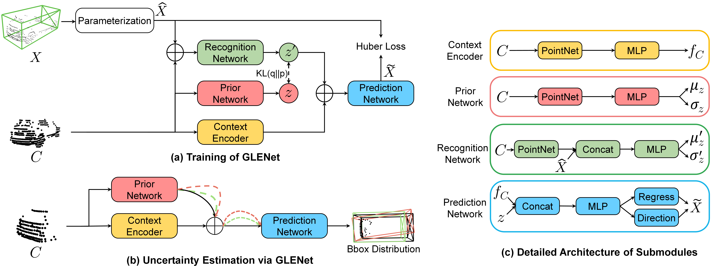
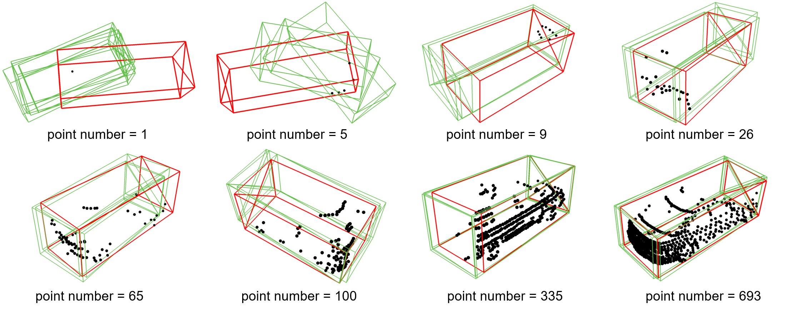

# GLENet 
[](https://paperswithcode.com/sota/3d-object-detection-on-kitti-cars-hard?p=glenet-boosting-3d-object-detectors-with) 
[](https://arxiv.org/abs/2207.02466)

## Overview
- [Introduction](#introduction)
- [Installation](#installation)
- [Dataset Preparation](#dataset-preparation)
- [Generate Label Uncertainty with GLEnet](#generate-label-uncertainty-with-glenet)
- [Probabilistic Object Detectors](#probabilistic-object-detectors)
- [License](#license)
- [Acknowledgement](#acknowledgement)

## Introduction
Implementation of paper: "GLENet: Boosting 3D Object Detectors with Generative Label Uncertainty Estimation". The implementation contains two parts, GLENet for generating label uncertainty and probability detectors part implemented based on [`[OpenPcdet 0.5.2]`](https://github.com/open-mmlab/OpenPCDet).

<p align="center">
  
  
</p>
<p align="center">
  
  <figcaption align = "center">Fig.1 Visual results of GLENet. The ground-truth and predictions are colored in red and green</figcaption>
</p>

## Installation
### Requrements
* Linux
* Python 3.6+
* PyTorch 1.1 or higher (tested on PyTorch 1.1, 1,3, 1,5~1.10)
* CUDA 9.0 or higher (PyTorch 1.3+ needs CUDA 9.2+)
* [`spconv v1.0 (commit 8da6f96)`](https://github.com/traveller59/spconv/tree/8da6f967fb9a054d8870c3515b1b44eca2103634) or [`spconv v1.2`](https://github.com/traveller59/spconv)
### Install
* a. install dependent python libraries:
```
cd GLENet;pip install -r requirements.txt 
```

* b. Install the SparseConv library, we use the implementation from [`[spconv]`](https://github.com/traveller59/spconv). 
    * If you use PyTorch 1.1, then make sure you install the `spconv v1.0` with ([commit 8da6f96](https://github.com/traveller59/spconv/tree/8da6f967fb9a054d8870c3515b1b44eca2103634)) instead of the latest one.
    * If you use PyTorch 1.3+, then you need to install the `spconv v1.2`. As mentioned by the author of [`spconv`](https://github.com/traveller59/spconv), you need to use their docker if you use PyTorch 1.4+.
* c. Install this `pcdet` library and its dependent libraries by running the following command:
```shell
python setup.py develop
```
## Dataset Preparation
### KITTI Dataset
* Please download the official [KITTI 3D object detection](http://www.cvlibs.net/datasets/kitti/eval_object.php?obj_benchmark=3d) dataset and organize the downloaded files as follows (the road planes could be downloaded from [[road plane]](https://drive.google.com/file/d/1d5mq0RXRnvHPVeKx6Q612z0YRO1t2wAp/view?usp=sharing), which are optional for data augmentation in the training):

```
GLENet
├── data
│   ├── kitti
│   │   │── ImageSets
│   │   │── training
│   │   │   ├──calib & velodyne & label_2 & image_2 & planes
│   │   │── testing
│   │   │   ├──calib & velodyne & image_2
├── cvae_uncertainty
├── pcdet
├── tools
```

* Generate the data infos by running the following command: 
```python 
python -m pcdet.datasets.kitti.kitti_dataset create_kitti_infos tools/cfgs/dataset_configs/kitti_dataset.yaml
```
### Waymo Open Dataset
* Please download the official [Waymo Open Dataset](https://waymo.com/open/download/)(v1.2.0), 
including the training data `training_0000.tar~training_0031.tar` and the validation 
data `validation_0000.tar~validation_0007.tar`.
* Unzip all the above `xxxx.tar` files to the directory of `data/waymo/raw_data` as follows (You could get 798 *train* tfrecord and 202 *val* tfrecord ):  
```
GLENet
├── data
│   ├── waymo
│   │   │── ImageSets
│   │   │── raw_data
│   │   │   │── segment-xxxxxxxx.tfrecord
|   |   |   |── ...
|   |   |── waymo_processed_data_v0_5_0
│   │   │   │── segment-xxxxxxxx/
|   |   |   |── ...
│   │   │── waymo_processed_data_v0_5_0_gt_database_train_sampled_1/
│   │   │── waymo_processed_data_v0_5_0_waymo_dbinfos_train_sampled_1.pkl
│   │   │── waymo_processed_data_v0_5_0_gt_database_train_sampled_1_global.npy (optional)
│   │   │── waymo_processed_data_v0_5_0_infos_train.pkl (optional)
│   │   │── waymo_processed_data_v0_5_0_infos_val.pkl (optional)
├── cvae_uncertainty
├── pcdet
├── tools
```
* Install the official `waymo-open-dataset` by running the following command: 
```shell script
pip3 install --upgrade pip
# tf 2.0.0
pip3 install waymo-open-dataset-tf-2-5-0 --user
```

* Extract point cloud data from tfrecord and generate data infos by running the following command (it takes several hours, 
and you could refer to `data/waymo/waymo_processed_data_v0_5_0` to see how many records that have been processed): 
```python 
python -m pcdet.datasets.waymo.waymo_dataset --func create_waymo_infos \
    --cfg_file tools/cfgs/dataset_configs/waymo_dataset.yaml
```

Note that you do not need to install `waymo-open-dataset` if you have already processed the data before and do not need to evaluate with official Waymo Metrics.


## Generate Label Uncertainty with GLEnet
### step 1.0: prepare data for GLENet <br>
ln -s  data/kitti cvae_uncertainty <br>
ln -s  data/waymo cvae_uncertainty <br>
### step1.1: Train GLENet:
```
cd cvae_uncertainty;mkdir -p logs;
exp_id=exp20 # you can set other exp_id
for iter in `seq 0 9`;do
    sed "s@# FOLD_IDX: 0@FOLD_IDX: ${iter}@" cfgs/${exp_id}_gen_ori.yaml > cfgs/${exp_id}_gen.yaml
    grep FOLD cfgs/${exp_id}_gen.yaml
    CUDA_VISIBLE_DEVICES=0,1 bash scripts/dist_train.sh 2 --cfg_file cfgs/${exp_id}_gen.yaml --tcp_port 18889  --max_ckpt_save_num 10  --workers 1 --extra_tag fold_${iter} &>> logs/${exp_id}_gen_fold_${iter}.log
done
```
### step 1.2: GLENet Prediction:
```
cd cvae_uncertainty;
exp_id=exp20
for iter in `seq 0 9`;do
    sed "s@# FOLD_IDX: 0@FOLD_IDX: ${iter}@" cfgs/${exp_id}_gen_ori.yaml > cfgs/${exp_id}_gen.yaml
    grep FOLD cfgs/${exp_id}_gen.yaml
    sh predict.sh ${exp_id}_gen fold_${iter} 400 0
done
```
### step 1.3: Generate and Save Label Uncertainty
* mkdir -p output/uncertainty_dump
* python mapping_uncertainty.py
* python change_gt_infos.py

Then you can use the new *.pkl that contains label uncertainty to **replace** the origin file.

We provide the [kitti_infos_train.pkl](https://drive.google.com/file/d/1iQl3krptYDBfmLsQFR8xip4Wtl8jj-Uy/view?usp=sharing) and [kitti_dbinfos_train.pkl](https://drive.google.com/file/d/1bSmFeO3M4YgXsUG8qSfs_aPoXWXSPX3C/view?usp=sharing) that contain label uncertainty.


## Probabilistic Object Detectors
### Training
```
cd tools;
python train.py --cfg_file ./cfgs/kitti_models/GLENet_VR.yaml
```
Multi gpu training, assuming you have 4 gpus:

```
CUDA_VISIBLE_DEVICES=0,1,2,3 bash scripts/dist_train.sh 4 --cfg_file ./cfgs/kitti_models/GLENet_VR.yaml

```

### Testing
```
cd tools/
```
Single gpu testing for all saved checkpoints, assuming you have 4 gpus:
```
python test.py --eval_all --cfg_file ./cfgs/kitti_models/GLENet_VR.yaml
```

Multi gpu testing for all saved checkpoints, assuming you have 4 gpus:
```
CUDA_VISIBLE_DEVICES=0,1,2,3 bash scripts/dist_test.sh 4 --eval_all --cfg_file ./cfgs/kitti_models/GLENet_VR.yaml
```

Multi gpu testing a specific checkpoint, assuming you have 4 gpus and checkpoint_39 is your best checkpoint :
```
CUDA_VISIBLE_DEVICES=0,1,2,3 bash scripts/dist_test.sh 4  --cfg_file ./cfgs/kitti_models/GLENet_VR.yaml --ckpt ../output/GLENet_VR/default/ckpt/checkpoint_epoch_80.pth
```

## Pretrained Models
We provide the pre-trained models for car class on the KITTI dataset.

| Method | Simple@R11 | Moderate@R11 | Hard@R11 | Moderate@R40 | Download |
|--------|----------:|:-------:|:-------:|:-------:|:---------:|
| SECOND(Baseline) | 88.61 | 78.62 | 77.22 | 79.94 | - |
| [GLENet-S(Ours)](tools/cfgs/kitti_models/GLENet_S.yaml) | 88.60 | 84.41 | 78.42 | 84.81 | [Download](https://drive.google.com/file/d/1gC-cGRer0X56F1i2AGr4WQar-0NTO6sN/view?usp=sharing) |
| CIA-SSD(Baseline) | 90.04 | 79.81 | 78.80 | 84.16 | - |
| [GLENet-C(Ours)](tools/cfgs/kitti_models/GLENet_C.yaml) | 89.81 | 84.54 | 78.82 | 85.19 | [Download](https://drive.google.com/file/d/1wJfE7lDCsLuVhua-OyXpPLYO7rhK15eZ/view?usp=sharing) |
| Voxel R-CNN(Baseline) | 89.41 | 84.52 | 78.93 | 85.29 | - |
| [GLENet-VR(Ours)](tools/cfgs/kitti_models/GLENet_VR.yaml) | 89.95 | 86.49 | 79.18 | 86.23 | [Download](https://drive.google.com/file/d/1FKZmaD7HCMFJg5TloBzAt_2S7QmQY9fX/view?usp=sharing) |


## Citation
If you find this work useful in your research, please consider citing:
```
@article{zhang2023glenet,
    title={GLENet: Boosting 3D object detectors with generative label uncertainty estimation},
    author={Zhang, Yifan and Zhang, Qijian and Zhu, Zhiyu and Hou, Junhui and Yuan, Yixuan},
    journal={International Journal of Computer Vision},
    volume={131},
    number={12},
    pages={3332--3352},
    year={2023}
}
```

## License
`GLENet` is released under the [Apache 2.0 license](LICENSE).

## Acknowledgement
Thanks for the OpenPCDet, the implementation of probabilistic object detectors part is mainly based on the pcdet v0.5.2.
